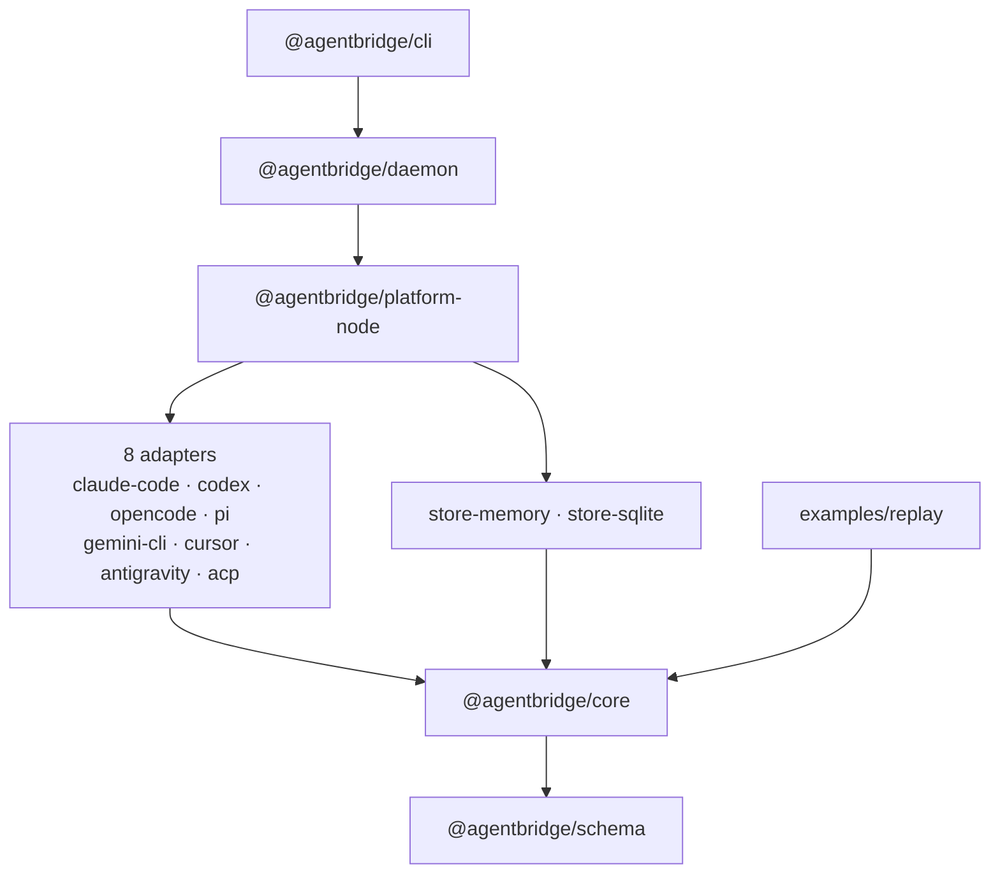

<div align="center">

# Bridge

One typed model for coding-agent sessions, whichever harness recorded them.

[](https://github.com/jagenaujagenau/agents-bridge/stargazers)
[](tsconfig.json)
[](package.json)

</div>

## What is this?

Bridge reads coding-agent history from eight sources and turns every session into the same canonical
`Session` plus an ordered `SessionEvent` stream. Applications built on it never need to know which
harness produced a session. The wire format is plain JSON / JSONL with published JSON Schemas, so
consuming it doesn't require Effect.

```text
Claude Code  JSONL ────┐
Codex        rollouts ─┤
OpenCode     SQLite ───┤
pi           JSONL ────┤
Gemini CLI   JSON ─────┼─> one Session + SessionEvent stream
Cursor       JSONL ────┤
Antigravity  JSONL ────┤
ACP          live / recorded JSON-RPC ─┘
```

Built with Effect v4 (`4.0.0-rc.115`) for Schema, Stream, Layer and services.

## Quick Start

```bash
pnpm install
pnpm check                 # typecheck + tests

pnpm bridge doctor         # what is installed, where history lives
pnpm bridge sessions --harness codex
pnpm bridge show <session-id>
pnpm bridge events <session-id>
```

The CLI runs TypeScript directly with `node` and uses `node:sqlite`, so use a recent Node release.

<details>
<summary>All CLI commands</summary>

```bash
pnpm bridge harnesses
pnpm bridge events <session-id> --jsonl          # canonical JSONL
pnpm bridge events <session-id> --git --redact   # derive + verify commits, mask secrets
pnpm bridge watch <session-id>                   # existing events, then new ones as the session grows
pnpm bridge index                                # import everything into the SQLite index ($BRIDGE_DB)
pnpm bridge daemon start --detach                # serve Bridge on ~/.bridge/daemon.sock; other commands use it automatically
pnpm bridge daemon status | stop
pnpm bridge export <session-id> --out ./out

pnpm audit:local           # normalize every local session; report counts, warnings, invariant violations
```

</details>

Each harness's history location can be overridden: `CLAUDE_CONFIG_DIR`, `CODEX_HOME`,
`OPENCODE_DATA_DIR`, `PI_CODING_AGENT_DIR`, `GEMINI_CLI_HOME`, `CURSOR_CONFIG_DIR`,
`ANTIGRAVITY_HOME`, `BRIDGE_ACP_RECORDINGS`.

### Replay

`examples/replay` is a web app that rebuilds any session as chapters, scenes, a stable code map and
linked evidence, plus a fleet view of every session over time. It uses only `Session` and
`SessionEvent`, with no provider-specific branches; an architectural test enforces that.

```bash
pnpm replay                # http://localhost:5173
```

See [examples/replay/README.md](examples/replay/README.md).

## Using it from code

```ts
import { Bridge } from "@agentbridge/core"
import { NodeBridge } from "@agentbridge/platform-node"
import { Effect, Stream } from "effect"

const program = Effect.gen(function*() {
  const bridge = yield* Bridge
  const { session, warnings } = yield* bridge.sessions.get("codex:019e469b-…")
  yield* bridge.sessions.events(session.id).pipe(
    Stream.runForEach((event) => {
      switch (event.type) {
        case "user.message":      /* conversation */ break
        case "command.completed": /* terminal: event.outcome, event.exitCode? */ break
        case "file.changed":      /* diff view: event.path, event.diff? */ break
      }
      return Effect.void
    })
  )
})

program.pipe(Effect.provide(NodeBridge.layer()), Effect.runPromise)
```

Live ACP traffic produces the same event type:

```ts
import { acpEvents } from "@agentbridge/adapter-acp"

messagesFromYourAcpClient.pipe(               // Stream<unknown> of JSON-RPC messages
  acpEvents({ agent: "gemini", sessionId }),  // Stream<SessionEvent>
  Stream.runForEach(renderEvent)
)
```

To talk to a running daemon instead, provide `DaemonBridge.layer({ socket })` from
`@agentbridge/daemon`. It serves the same `Bridge` API over the socket, so nothing else changes.

## Architecture



`core` never names a harness, and consumers never import adapters. Node-specific wiring lives only
in `platform-node`. Details in [docs/architecture.md](docs/architecture.md).

| Package | Role |
|---|---|
| `@agentbridge/schema` | Protocol: IDs, `Session`, `SessionEvent`, codecs, stable IDs, JSON Schema generation |
| `@agentbridge/core` | `Bridge`, `HarnessRegistry`, `SessionStore`, errors, shared normalization pipeline |
| `@agentbridge/adapter-claude-code` | `~/.claude/projects/**.jsonl` |
| `@agentbridge/adapter-codex` | `~/.codex/sessions/**/rollout-*.jsonl` |
| `@agentbridge/adapter-opencode` | `~/.local/share/opencode/opencode.db` (read-only SQLite) |
| `@agentbridge/adapter-pi` | `~/.pi/agent/sessions/**.jsonl` |
| `@agentbridge/adapter-gemini-cli` | `~/.gemini/tmp/*/chats/session-*.json` |
| `@agentbridge/adapter-cursor` | `~/.cursor/projects/*/agent-transcripts/**.jsonl` |
| `@agentbridge/adapter-antigravity` | `~/.gemini/antigravity[-cli]/brain/*/.system_generated/logs/transcript*.jsonl` |
| `@agentbridge/adapter-acp` | ACP v1 streams (`acpEvents`) and recordings |
| `@agentbridge/store-memory` | In-memory `SessionStore` |
| `@agentbridge/store-sqlite` | Persistent `SessionStore` on `node:sqlite`, incremental by source fingerprint |
| `@agentbridge/platform-node` | `NodeBridge.layer()`, version probing, `node:sqlite` reader, local history audit |
| `@agentbridge/testing` | Fixtures, adapter/store contract suites, invariants, semantic projection, goldens |
| `@agentbridge/daemon` | Background service on a Unix socket, and `DaemonBridge`: the same `Bridge` API as a client |
| `@agentbridge/cli` | `bridge` reference CLI |

## Project Structure

```text
agents-bridge/
├── docs/
│   ├── research/                 # what real history formats look like
│   ├── adapter-authoring.md
│   ├── architecture.md
│   ├── decisions.md
│   ├── protocol.md
│   └── spec.md                   # the full spec
├── examples/
│   └── replay/                   # session replay web app
├── packages/
│   ├── adapter-*/                # one per harness (8)
│   ├── cli/
│   ├── core/
│   ├── daemon/
│   ├── platform-node/
│   ├── schema/
│   ├── store-memory/
│   ├── store-sqlite/
│   └── testing/
├── schemas/
│   └── v1/                       # published JSON Schemas
├── package.json
├── pnpm-workspace.yaml
├── tsconfig.json
└── vitest.config.ts
```

## Documentation

| Resource | Description |
|----------|-------------|
| [Protocol](docs/protocol.md) | Wire format, events, IDs, ordering, export bundle |
| [Architecture](docs/architecture.md) | Packages, data flow, services and layers |
| [Adapter authoring](docs/adapter-authoring.md) | Rules, testing, compatibility matrix |
| [Decisions](docs/decisions.md) | Where and why the implementation departs from the spec |
| [Reference findings](docs/research/reference-findings.md) | What real history formats look like |
| [Spec](docs/spec.md) | The full Bridge specification |
| [JSON Schemas](schemas/v1) | `session`, `event`, `manifest`, `import-warning` |
| [Replay](examples/replay/README.md) | The reference application |

## Status

v0.1 scope (spec §94) is met, and v0.2 extends it to every harness in the reference set:

- `bridge harnesses` detects all eight sources, and `bridge sessions` lists them through one registry.
- `bridge events --jsonl` emits valid canonical events.
- The same §63 scenario, recorded natively for each harness, produces the same semantic event
  sequence (adjusted only by declared capabilities).
- `pnpm audit:local` on the development machine normalizes 607 real sessions from five harnesses
  with zero invariant violations.

Gemini CLI and Antigravity are verified only against fixtures built from their documented formats,
because no local history was available. See [docs/decisions.md](docs/decisions.md).

| Version | Adds |
|---|---|
| v0.3 | Turns, token usage, user shell commands, plans from todo tools, `bridge watch` for every harness, the SQLite index, git and redaction enrichers |
| v0.4 | Tailing growing sessions from the last byte offset, turns for every harness, verified derived commits, redacted session metadata |
| v0.5 | The background daemon: one process serves many clients over an owner-only Unix socket, with one shared tail per watched session |

## Contributing

Adding a harness? Start with [docs/adapter-authoring.md](docs/adapter-authoring.md). Every adapter
must pass the contract suites in `@agentbridge/testing`, and `pnpm check` must stay green.
Golden files are refreshed with `pnpm update-golden`.

<a href="https://github.com/jagenaujagenau/agents-bridge/graphs/contributors">
  
</a>

---

<div align="center">

[](https://star-history.com/#jagenaujagenau/agents-bridge&Date)

</div>
